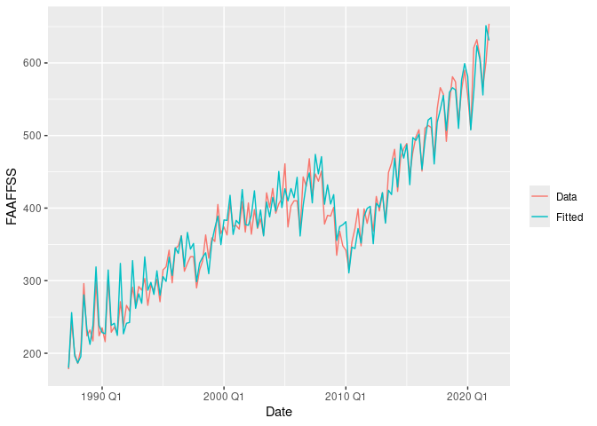
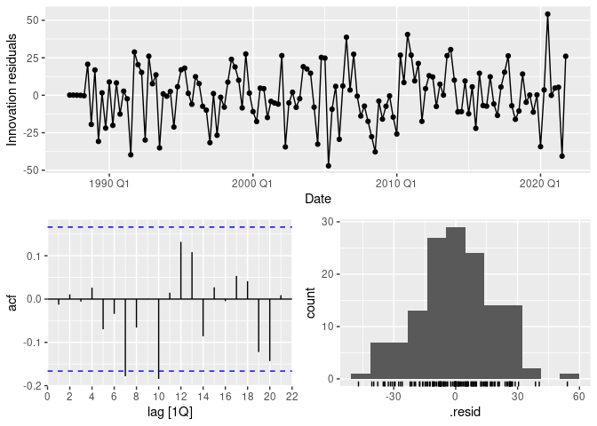
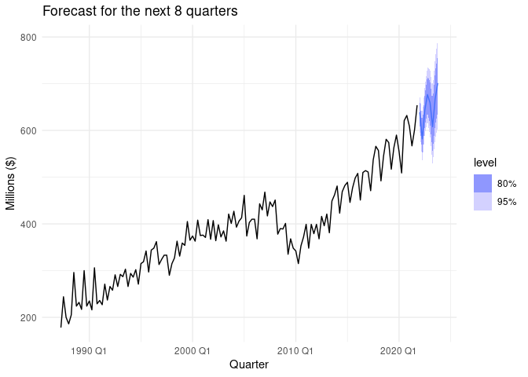

### Import Data

    base_data = read_csv("qgdp_training.csv")

    ## Rows: 139 Columns: 34
    ## ── Column specification ────────────────────────────────────────────────────────
    ## Delimiter: ","
    ## chr  (1): Date
    ## dbl (33): Agriculture, Forestry and Logging, Fishing, Aquaculture and Agricu...
    ## 
    ## ℹ Use `spec()` to retrieve the full column specification for this data.
    ## ℹ Specify the column types or set `show_col_types = FALSE` to quiet this message.

    data = base_data %>% 
      select(Date, 
             `Fishing, Aquaculture and Agriculture, Forestry and Fishing Support Services`) %>% 
      mutate(Date = yearquarter(Date)) %>% 
      rename(FAAFFSS = `Fishing, Aquaculture and Agriculture, Forestry and Fishing Support Services`)
    data = as_tsibble(data, index=Date)
    rm(list="base_data") #Delete the original dataset

    data %>% autoplot() + 
      labs(title="New Zealand Fishing, Aquaculture and Agriculture, Forestry and Fishing Support Services (FAAFFSS) GDP ($ Millions) from 1987Q2 to 2021Q4", x= "Quarter", y="FAAFFSS")

    ## Plot variable not specified, automatically selected `.vars = FAAFFSS`

 \#
Methodology to Create a Shortlist of Appropriate Candidate ETS Models

    # Check for missing values
    missing_values <- data %>% summarise(across(everything(), ~ sum(is.na(.))))
    print(missing_values)

    ## # A tsibble: 139 x 2 [1Q]
    ##       Date FAAFFSS
    ##      <qtr>   <int>
    ##  1 1987 Q2       0
    ##  2 1987 Q3       0
    ##  3 1987 Q4       0
    ##  4 1988 Q1       0
    ##  5 1988 Q2       0
    ##  6 1988 Q3       0
    ##  7 1988 Q4       0
    ##  8 1989 Q1       0
    ##  9 1989 Q2       0
    ## 10 1989 Q3       0
    ## # ℹ 129 more rows

## Manual Model Fitting:

Defining ETS Models: Manually specify and fit a variety of ETS models
with different combinations of error (E), trend (T), and seasonality (S)
components.

The models are categorized as follows:

Error Component (E): Additive (A) or Multiplicative (M).

Trend Component (T): None (N), Additive (A), Multiplicative (M), or
Additive damped (Ad).

Seasonality Component (S): None (N), Additive (A), or Multiplicative
(M).

Model Examples: Fit models such as ETS(A, N, N) for Simple Exponential
Smoothing, ETS(A, A, N) for Holt’s Linear Trend, and ETS(A, A, A) for
Additive Holt-Winters, among others.

    # Manually fit different ETS models
    # ETS(A,N,N): Model for simple exponential smoothing (SES)
    fit_ann <- data %>% model(ETS(FAAFFSS ~ error("A") + trend("N") + season("N")))
    # ETS(M,N,N): SES with multiplicative errors
    fit_mnn <- data %>% model(ETS(FAAFFSS ~ error("M") + trend("N") + season("N")))
    # ETS(A,A,N): A model for Holt’s linear trend method
    fit_aan <- data %>% model(ETS(FAAFFSS ~ error("A") + trend("A") + season("N")))
    # ETS(M,A,N): Holt’s linear trend method with multiplicative errors
    fit_man <- data %>% model(ETS(FAAFFSS ~ error("M") + trend("A") + season("N")))
    fit_amn <- data %>% model(ETS(FAAFFSS ~ error("A") + trend("M") + season("N")))
    fit_mmn <- data %>% model(ETS(FAAFFSS ~ error("M") + trend("M") + season("N")))
    fit_ana <- data %>% model(ETS(FAAFFSS ~ error("A") + trend("N") + season("A")))
    fit_mna <- data %>% model(ETS(FAAFFSS ~ error("M") + trend("N") + season("A")))
    fit_aaa <- data %>% model(ETS(FAAFFSS ~ error("A") + trend("A") + season("A")))
    fit_maa <- data %>% model(ETS(FAAFFSS ~ error("M") + trend("A") + season("A")))
    fit_ama <- data %>% model(ETS(FAAFFSS ~ error("A") + trend("M") + season("A")))
    fit_mma <- data %>% model(ETS(FAAFFSS ~ error("M") + trend("M") + season("A")))
    fit_anm <- data %>% model(ETS(FAAFFSS ~ error("A") + trend("N") + season("M")))
    fit_mnm <- data %>% model(ETS(FAAFFSS ~ error("M") + trend("N") + season("M")))
    fit_aam <- data %>% model(ETS(FAAFFSS ~ error("A") + trend("A") + season("M")))
    fit_mam <- data %>% model(ETS(FAAFFSS ~ error("M") + trend("A") + season("M")))
    fit_amm <- data %>% model(ETS(FAAFFSS ~ error("A") + trend("M") + season("M")))
    fit_mmm <- data %>% model(ETS(FAAFFSS ~ error("M") + trend("M") + season("M")))
    fit_adn <- data %>% model(ETS(FAAFFSS ~ error("A") + trend("Ad") + season("N")))
    fit_mdn <- data %>% model(ETS(FAAFFSS ~ error("M") + trend("Ad") + season("N")))
    fit_ada <- data %>% model(ETS(FAAFFSS ~ error("A") + trend("Ad") + season("A")))
    fit_mda <- data %>% model(ETS(FAAFFSS ~ error("M") + trend("Ad") + season("A")))
    fit_adm <- data %>% model(ETS(FAAFFSS ~ error("A") + trend("Ad") + season("M")))
    fit_mdm <- data %>% model(ETS(FAAFFSS ~ error("M") + trend("Ad") + season("M")))

## Automatic Model Selection:

Using Automated ETS: Utilize the ETS function to automatically fit the
best ETS model based on information criteria like AICc (Akaike
Information Criterion corrected for small sample sizes).

    # Automatically fit the ETS model
    fit_auto <- data %>% model(ETS(FAAFFSS))
    report(fit_auto)

    ## Series: FAAFFSS 
    ## Model: ETS(M,A,M) 
    ##   Smoothing parameters:
    ##     alpha = 0.5044422 
    ##     beta  = 0.007167769 
    ##     gamma = 0.4955577 
    ## 
    ##   Initial states:
    ##      l[0]     b[0]      s[0]     s[-1]    s[-2]     s[-3]
    ##  193.4443 5.672164 0.8798408 0.9597361 1.256635 0.9037881
    ## 
    ##   sigma^2:  0.0027
    ## 
    ##      AIC     AICc      BIC 
    ## 1518.864 1520.260 1545.275

## Model Comparison:

Calculating AICc Values: For each manually fitted model and the
automatically selected model, compute the AICc value. The AICc penalizes
model complexity to prevent overfitting and is useful for comparing
models.

Ranking Models: Create a list of all candidate models along with their
AICc values. Sort the models by AICc in ascending order to identify the
best-performing models.

Choosing the Lowest AICc Model: Select the model with the lowest AICc
value as the best model. This model is expected to balance goodness of
fit and model complexity.

    # Compare models using AICc
    aic_values <- bind_rows(
      glance(fit_aaa) %>% mutate(Model = "AAA"),
      glance(fit_ann) %>% mutate(Model = "ANN"),
      glance(fit_mnn) %>% mutate(Model = "MNN"),
      glance(fit_aan) %>% mutate(Model = "AAN"),
      glance(fit_man) %>% mutate(Model = "MAN"),
      glance(fit_amn) %>% mutate(Model = "AMN"),
      glance(fit_mmn) %>% mutate(Model = "MMN"),
      glance(fit_ana) %>% mutate(Model = "ANA"),
      glance(fit_mna) %>% mutate(Model = "MNA"),
      glance(fit_maa) %>% mutate(Model = "MAA"),
      glance(fit_ama) %>% mutate(Model = "AMA"),
      glance(fit_mma) %>% mutate(Model = "MMA"),
      glance(fit_anm) %>% mutate(Model = "ANM"),
      glance(fit_mnm) %>% mutate(Model = "MNM"),
      glance(fit_aam) %>% mutate(Model = "AAM"),
      glance(fit_mam) %>% mutate(Model = "MAM"),
      glance(fit_mmm) %>% mutate(Model = "MMM"),
      glance(fit_amm) %>% mutate(Model = "AMM"),
      glance(fit_adn) %>% mutate(Model = "AAdN"),
      glance(fit_mdn) %>% mutate(Model = "MAdN"),
      glance(fit_ada) %>% mutate(Model = "AAdA"),
      glance(fit_mda) %>% mutate(Model = "MAdA"),
      glance(fit_adm) %>% mutate(Model = "AAdM"),
      glance(fit_mdm) %>% mutate(Model = "MAdM"),
      glance(fit_auto) %>% mutate(Model = "AUTO_MAM"),
    ) %>% select(Model, AICc) %>% arrange(AICc)

    print(aic_values)

    ## # A tibble: 25 × 2
    ##    Model     AICc
    ##    <chr>    <dbl>
    ##  1 MAM      1520.
    ##  2 AUTO_MAM 1520.
    ##  3 MAdM     1520.
    ##  4 AAM      1523.
    ##  5 AMM      1524.
    ##  6 AAA      1527.
    ##  7 AAdM     1528.
    ##  8 AMA      1529.
    ##  9 MMM      1530.
    ## 10 ANM      1530.
    ## # ℹ 15 more rows

## Reasons for Selecting the ETS(MAM) Model: Lowest AICc Value

Model Comparison: Among the various manually fitted models and the
automatically selected model, ETS(MAM) was found to have the lowest AICc
value. The AICc (Akaike Information Criterion corrected for small sample
sizes) is a measure of the relative quality of statistical models for a
given set of data. It considers both the goodness of fit and the
complexity of the model (penalizing for the number of parameters). A
lower AICc value indicates a better balance between model fit and
complexity.

Statistical Justification: Selecting the model with the lowest AICc
helps in minimizing overfitting while ensuring that the model adequately
captures the underlying patterns in the data.

    # Select the best model based on the lowest AICc value
    best_model <- fit_mam 
    report(best_model)

    ## Series: FAAFFSS 
    ## Model: ETS(M,A,M) 
    ##   Smoothing parameters:
    ##     alpha = 0.5044422 
    ##     beta  = 0.007167769 
    ##     gamma = 0.4955577 
    ## 
    ##   Initial states:
    ##      l[0]     b[0]      s[0]     s[-1]    s[-2]     s[-3]
    ##  193.4443 5.672164 0.8798408 0.9597361 1.256635 0.9037881
    ## 
    ##   sigma^2:  0.0027
    ## 
    ##      AIC     AICc      BIC 
    ## 1518.864 1520.260 1545.275

## In an ETS(MAM) model:

E stands for the error term, which is multiplicative.

T stands for the trend component, which is additive.

S stands for the seasonal component, which is multiplicative.

The general form of the ETS(MAM) model equations are:
*y**t* = (*l**t* − 1+*b**t* − 1)*s**t* − *m*(1+*ϵ**t*)
*l**t* = (*l**t* − 1+*b**t* − 1)(1+*α**ϵ**t*)
*b**t* = *b**t* − 1 + *β*(*l**t* − 1+*b**t* − 1)*ϵ**t*
*s**t* = *s**t* − *m*(1+*γ**ϵ**t*)
Where:

*y**t* is the observed value at time t.

*l**t* is the level component at time t.

*b**t* is the trend component at time t.

*s**t* is the seasonal component at time t.

α, β, and γ are the smoothing parameters for the level, trend, and
seasonal components, respectively.

m is the period of seasonality.

    # Plot the fitted values
    best_model %>% augment()

    ## # A tsibble: 139 x 6 [1Q]
    ## # Key:       .model [1]
    ##    .model                                  Date FAAFFSS .fitted  .resid   .innov
    ##    <chr>                                  <qtr>   <dbl>   <dbl>   <dbl>    <dbl>
    ##  1 "ETS(FAAFFSS ~ error(\"M\") + trend… 1987 Q2     178    180.  -1.96  -0.0109 
    ##  2 "ETS(FAAFFSS ~ error(\"M\") + trend… 1987 Q3     244    256. -12.0   -0.0467 
    ##  3 "ETS(FAAFFSS ~ error(\"M\") + trend… 1987 Q4     200    196.   3.76   0.0192 
    ##  4 "ETS(FAAFFSS ~ error(\"M\") + trend… 1988 Q1     186    187.  -0.583 -0.00313
    ##  5 "ETS(FAAFFSS ~ error(\"M\") + trend… 1988 Q2     205    195.   9.63   0.0493 
    ##  6 "ETS(FAAFFSS ~ error(\"M\") + trend… 1988 Q3     296    280.  15.6    0.0556 
    ##  7 "ETS(FAAFFSS ~ error(\"M\") + trend… 1988 Q4     224    233.  -9.12  -0.0391 
    ##  8 "ETS(FAAFFSS ~ error(\"M\") + trend… 1989 Q1     232    212.  19.8    0.0932 
    ##  9 "ETS(FAAFFSS ~ error(\"M\") + trend… 1989 Q2     217    238. -21.3   -0.0895 
    ## 10 "ETS(FAAFFSS ~ error(\"M\") + trend… 1989 Q3     300    319. -18.9   -0.0593 
    ## # ℹ 129 more rows

    augment(best_model) %>%
    ggplot(aes(x = Date)) +
    geom_line(aes(y = FAAFFSS, colour = "Data")) +
    geom_line(aes(y = .fitted, colour = "Fitted")) +
    guides(colour = guide_legend(title = ""))

 \## Model
Diagnostics:

Residual Analysis: Perform residual diagnostics on the selected model to
ensure that the residuals behave like white noise (i.e., they are
uncorrelated and have constant variance).

Components Decomposition: Decompose the selected model to inspect its
components (level, trend, and seasonality) for better understanding and
validation.

    # Residual diagnostics
    best_model %>% gg_tsresiduals()

    # Components Decomposition
    best_model %>%
      components() %>% 
      autoplot()

    ## Warning: Removed 4 rows containing missing values or values outside the scale range
    ## (`geom_line()`).

    # Generate forecasts
    forecast_data <- best_model %>% forecast(h = 8)
    forecast_data

    ## # A fable: 8 x 4 [1Q]
    ## # Key:     .model [1]
    ##   .model                                                 Date      FAAFFSS .mean
    ##   <chr>                                                 <qtr>       <dist> <dbl>
    ## 1 "ETS(FAAFFSS ~ error(\"M\") + trend(\"A\") + seaso… 2022 Q1 N(617, 1014)  617.
    ## 2 "ETS(FAAFFSS ~ error(\"M\") + trend(\"A\") + seaso… 2022 Q2 N(569, 1085)  569.
    ## 3 "ETS(FAAFFSS ~ error(\"M\") + trend(\"A\") + seaso… 2022 Q3 N(628, 1599)  628.
    ## 4 "ETS(FAAFFSS ~ error(\"M\") + trend(\"A\") + seaso… 2022 Q4 N(670, 2142)  670.
    ## 5 "ETS(FAAFFSS ~ error(\"M\") + trend(\"A\") + seaso… 2023 Q1 N(632, 3011)  632.
    ## 6 "ETS(FAAFFSS ~ error(\"M\") + trend(\"A\") + seaso… 2023 Q2 N(583, 2807)  583.
    ## 7 "ETS(FAAFFSS ~ error(\"M\") + trend(\"A\") + seaso… 2023 Q3 N(643, 3733)  643.
    ## 8 "ETS(FAAFFSS ~ error(\"M\") + trend(\"A\") + seaso… 2023 Q4 N(686, 4609)  686.

    forecast_data %>% autoplot(data) +
      labs(title = "Forecast for the next 8 quarters", x = "Quarter", y = "FAAFFSS")

## Explanation of Prediction Intervals

An advantage of ETS models is that prediction intervals can be
constructed. Prediction intervals will differ between additive and
multiplicative error models.

For ETS(A,N/A/Ad,N/A) models prediction distributions are Gaussian.

For ETS(M,N/A/Ad,N/A/M) models prediction distributions are non-Gaussian
because of nonlinearity of the state space equations.

Gaussian approximation usually give reasonably accurate results.

If this approximation is not reasonable, we can generate future sample
paths conditional on the last estimate of the states, and then to obtain
prediction intervals from the percentiles of these simulated future
paths.

In the ETS model, the prediction interval is calculated based on the
variance of the residuals. The ETS (MAM) model is a multiplicative error
model, and the calculation of its prediction interval takes into account
the gradual accumulation of prediction errors. Specifically, the
prediction interval is calculated through the following steps:

Calculate point prediction value: Based on the parameters of the ETS
model and input data at future time points, calculate the future point
prediction value.

Estimate the variance of the forecast error: Use the variance of the
residuals to estimate the variance of the forecast error. For the
multiplicative error model, the variance of the error increases with
forecast time.

Calculate the prediction interval: Based on the variance of the
prediction error and using the assumption of normal distribution,
calculate the prediction interval at different confidence levels.

In R, these steps are completed automatically by the forecast function,
we only need to specify the forecast time range h.

## Arima Models

### Explore different ARIMA models

### Explain any transformations or differencing required

From data autoplot graph, we can see that

1.  the seasonal variations are increasing over time which suggests a
    multiplicative seasonality pattern. So we would do a log
    transformation to stabilize the variance. This transformation
    converts multiplicative relationships into additive ones, making the
    series easier to model.

2.  the data seems have seasonal effects that repeat every 4 quarters.
    So we would also differencing for seasonality to remove this effect.

3.there is an upward trend indicates that the mean of the series is not
constant over time. So we would need to do first difference to make the
series stationary in terms of the trend. However, as the data have a
strong seasonal pattern, we will apply seasonal differencing first,
because sometimes the resulting series will be stationary and there will
be no need for a further first difference.

    # Log transform to remove the non-constant variance. 

    data %>% 
      autoplot(log(FAAFFSS) ) + 
      labs(x = "x", y = "difference of y") + 
      theme_minimal() 

 so it
moved the large of change in variability. variance roughly constant.

    # differencing seasonality

    data %>% 
      autoplot(log(FAAFFSS) %>% difference(lag=4)) + 
      labs(x = "x", y = "difference of y") + 
      theme_minimal() 

    ## Warning: Removed 4 rows containing missing values or values outside the scale range
    ## (`geom_line()`).

after differencing seasonality, we can’t see any patterns now. we
removed the autocorrelation in seasonality. It also shows flat trend and
the mean is roughly constant, which suggests we removed the trend by
seasonal differencing and we don’t need to to first order difference
anymore. So we have stationary time series.

    # test if now the time series data are stationary and non-seasonaly with KPSS test
    data  %>%
      features(FAAFFSS , unitroot_kpss)

    ## Warning: 1 error encountered for feature 1
    ## [1] The `urca` package must be installed to use this functionality. It can be installed with install.packages("urca")

    ## # A tibble: 1 × 0

    data  %>%
      features(difference(log(FAAFFSS), 4) , unitroot_kpss)

    ## Warning: 1 error encountered for feature 1
    ## [1] The `urca` package must be installed to use this functionality. It can be installed with install.packages("urca")

    ## # A tibble: 1 × 0

so we can see the change of kpss after applying the transformation and
difference. there is now no evidence against the null hypothesis. which
means we get a stationary time series.

Or we can test how many difference we need to do to get a stationary
time series. It shows 1 is enough, which with aligns with what we did.

    data %>%
    features(FAAFFSS, unitroot_ndiffs)

    ## Warning: 1 error encountered for feature 1
    ## [1] The `urca` package must be installed to use this functionality. It can be installed with install.packages("urca")

    ## # A tibble: 1 × 0

    data %>%
    mutate(log_fa = log(FAAFFSS)) %>%
    features(log_fa, feat_stl)

    ## # A tibble: 1 × 9
    ##   trend_strength seasonal_strength_year seasonal_peak_year seasonal_trough_year
    ##            <dbl>                  <dbl>              <dbl>                <dbl>
    ## 1          0.992                  0.869                  2                    1
    ## # ℹ 5 more variables: spikiness <dbl>, linearity <dbl>, curvature <dbl>,
    ## #   stl_e_acf1 <dbl>, stl_e_acf10 <dbl>

    data %>%
    features(FAAFFSS, unitroot_nsdiffs)

    ## # A tibble: 1 × 1
    ##   nsdiffs
    ##     <int>
    ## 1       1

### Describe methodology used to create a shortlist of appropriate candidate ARIMA models (Fit both manually & automatically)

Now we will check on the acf and pacf to help us decide appropriate
candidate ARIMA models.

    data %>%gg_tsdisplay( log(FAAFFSS) %>% difference(4) , plot_type = "partial")

    ## Warning: Removed 4 rows containing missing values or values outside the scale range
    ## (`geom_line()`).

    ## Warning: Removed 4 rows containing missing values or values outside the scale range
    ## (`geom_point()`).

For the autoregression process, we check the pacf plot and see that the
significant peaks up to 4 and no significant peaks afterwards. it
suggest 4 autoregressive terms. likewise,for the moving average process,
we check the acf plot and see significant peaks up to the order of 3 and
no significant peaks afterwards. it suggest 3 moving average terms. Now
we add the manual fit and automatical fit together.

    # Manually and Automatically fit candidate models 
    fit <- data %>%
      model(arima_013 = ARIMA(FAAFFSS ~ pdq(0, 1, 3)),
            arima_413 = ARIMA(FAAFFSS ~ pdq(4, 1, 0)),
            stepwise = ARIMA(FAAFFSS),
            search = ARIMA(FAAFFSS, stepwise = FALSE))

    ## Warning: 1 error encountered for stepwise
    ## [1] The `urca` package must be installed to use this functionality. It can be installed with install.packages("urca")

    ## Warning: 1 error encountered for search
    ## [1] The `urca` package must be installed to use this functionality. It can be installed with install.packages("urca")

### Select the best model & explain why

We compare the result of both manual and auto fit ARIMA model and select
the model with smallest AICc as the best model. Here we will select the
manually fitted one “arima\_013” as our best model.

    glance(fit) %>% 
      arrange(AICc) %>% 
      select(.model:BIC)

    ## # A tibble: 2 × 6
    ##   .model    sigma2 log_lik   AIC  AICc   BIC
    ##   <chr>      <dbl>   <dbl> <dbl> <dbl> <dbl>
    ## 1 arima_013   355.   -582. 1175. 1175. 1189.
    ## 2 arima_413   356.   -582. 1176. 1177. 1194.

    # Report best model
    fit %>%
      select(arima_013) %>%
      report()

    ## Series: FAAFFSS 
    ## Model: ARIMA(0,1,3)(0,1,1)[4] 
    ## 
    ## Coefficients:
    ##           ma1      ma2     ma3     sma1
    ##       -0.1995  -0.2150  0.0925  -0.5801
    ## s.e.   0.0866   0.0938  0.1052   0.0746
    ## 
    ## sigma^2 estimated as 354.5:  log likelihood=-582.38
    ## AIC=1174.76   AICc=1175.23   BIC=1189.25

### Write the model equation in backshift notation

This specifies an ARIMA(0, 1, 3) model, which means: p=0: No
autoregressive (AR) terms. d=1: First difference to achieve stationary.
q=3: Three moving average (MA) terms. Backshift Notation:

*W**t* = *Y**t* − *Y**t* − 1
The ARIMA(0, 1, 3) model is:

*W**t* = *ϵ**t* − *θ*1*ϵ**t* − 1 − *θ*2*ϵ**t* − 2 − *θ*3*ϵ**t* − 3

Substituting *W**t* gives:

*Y**t* − *Y**t* − 1 = *ϵ**t* − *θ*1*ϵ**t* − 1 − *θ*2*ϵ**t* − 2 − *θ*3*ϵ**t* − 3

Rearranging the terms, we get:

*Y**t* = *Y**t* − 1 + *ϵ**t* − *θ*1*ϵ**t* − 1 − *θ*2*ϵ**t* − 2 − *θ*3*ϵ**t* − 3

Where: - *Y**t* is the value of the series at time *t*. -
*ϵ**t* is the white noise error term at time *t*. -
*θ*1, *θ*2, *θ*3 are the parameters of
the MA terms.

### Produce residual diagnostic plots (ggtsresiduals())

    # Check residuals
    fit %>% 
      select(arima_013) %>%
      gg_tsresiduals()

### Produce forecasts for h=8 quarters

    fit %>% 
      select(arima_013) %>%
      forecast(h = 8) %>%
      autoplot(data) + 
      theme_minimal()

### Explain how prediction intervals are calculated for the method

Prediction intervals provide a range within which future observations
are expected to fall with a certain probability, typically 95%. Here’s
how prediction intervals are calculated for an ARIMA model:

1.  **Forecast Error Variance**: The prediction interval is based on the
    forecast error variance, which increases with the forecast horizon.
    For an ARIMA model, the forecast error at time *t* + *h* is
    calculated using the moving average (MA) process.

2.  **Standard Error of Forecast**: For an *h*-step ahead forecast, the
    standard error *σ**h* can be computed using the residuals
    of the fitted model and the MA terms.

The standard error *σ**h* accounts for the model parameters
and the white noise variance. It includes the accumulation of forecast
uncertainty as the horizon *h* increases.

1.  **Prediction Interval Formula**: For a 95% confidence interval, the
    critical value *z*0.025 is 1.96. Using the forecasted
    values and the calculated standard error, construct the prediction
    intervals.

*Ŷ**t* + *h* ± *z**α*/2 ⋅ *σ**h*

Where: - *Ŷ**t* + *h* is the forecasted value for time
*t* + *h*. - *z**α*/2 is the critical value from the standard
normal distribution for the desired confidence level (e.g., 1.96 for 95%
confidence). - *σ**h* is the standard error of the *h*-step
ahead forecast.

## Neural Network Auto Regression Model

To understand how a Neural Network Auto Regression (NNAR) model works,
its important to first understand the workings of a standard feed
forward neural network.

### Understanding Neural Networks

A neural network is modelled after the way human brains work, in that
each thought is a result of multiple different neurons firing. Neural
networks act in a similar way, in that each prediction or output of the
model is a result of several nodes or “neurons” combining their
predictions together to come to a single prediction. In a feedforward
neural network, the network is comprised of an input layer which
includes the input data being fed into the model, optional hidden layers
which taken in the output from the previous layer as input, and an
output layer which returns the final prediction. The most basic neural
network has no hidden layers, which acts the same as a linear regression
model, since each input is given a weight, plus an additional bias
(intercept) parameter. Hidden layers take the outputs of their preceding
layers as inputs and then take a weighted linear sum of them, and alter
them by a non linear function such as sigmoid or relu. These hidden
layers allow non linearity to be captured by the model for more
complicated relationships.

<figure>

<figcaption aria-hidden="true">Example Neural Network</figcaption>
</figure>

When training a feed forward neural network, each node in the network
begins with random weights, which are then adjusted to minimize some
metric - in the case of NNAR models this metric is MSE. Each iteration
of training updates the weights of each node in the network, and then
calculates the MSE of the models predictions when using these weights.
The network then uses a process called back propagation to assess each
node in the network to find which nodes were responsible for the most
error in the result, so that in the next iteration these nodes can have
their weights changed more drastically to improve the model as much as
possible.

### Understanding the Neural Network Auto Regression Model

NNAR models are neural networks which take lagged values of the time
series as inputs to the model in order to make predictions. These NNAR
models can have many hidden layers, but we fit ours with just one in
order to keep the model from being overly complicated. NNAR models are
described by the notation NNAR(p, P, k), where p represents the amount
of regular lagged inputs into the model, P represents the number of
seasonal lags included as input to the model, and k is the number of
neurons in the hidden layer. The easiest way to understand these
parameters is by looking at an example.

Say we are fitting an NNAR(3,2,3) model on a dataset with yearly
seasonality. Here we have a p parameter of 3, meaning in order to
predict *y**n*, we will take the lagged inputs
*y**n* − 1, *y**n* − 2, *y**n* − 3.
Additionally we have the P parameter of 2, meaning we will take the
seasonal lags *y**n* − 12, *y**n* − 24. This means
our model will have an input layer of 5 nodes which take in the lagged
inputs
*y**n* − 1, *y**n* − 2, *y**n* − 3, *y**n* − 12, *y**n* − 24.
Also since our model has a k parameter of 3, it means there is a hidden
layer containing 3 neurons, which each take the outputs from the input
layer as their respective inputs.

For our model we use the NNETAR() function to fit an NNAR model for us
which will calculate optimal parameters for us. By default the model
will determine p by fitting a linear model on the seasonally adjusted
time series and taking the optimal number of lags according to AIC. The
P parameter will automatically be set to 1, and the k parameter is set
to (p + P + 1)/2.

### Model fitting

    NN.fit = data %>% 
      model(base_model = NNETAR()) %>% 
      report(base_model)

    ## Model not specified, defaulting to automatic modelling of the `FAAFFSS`
    ## variable. Override this using the model formula.

    ## Series: FAAFFSS 
    ## Model: NNAR(1,1,2)[4] 
    ## 
    ## Average of 20 networks, each of which is
    ## a 2-2-1 network with 9 weights
    ## options were - linear output units 
    ## 
    ## sigma^2 estimated as 490.8

    NN.fit %>% gg_tsresiduals()

    ## Warning: Removed 4 rows containing missing values or values outside the scale range
    ## (`geom_line()`).

    ## Warning: Removed 4 rows containing missing values or values outside the scale range
    ## (`geom_point()`).

    ## Warning: Removed 4 rows containing non-finite outside the scale range
    ## (`stat_bin()`).

    NN.fit %>% 
      forecast(h=8) %>% 
      autoplot(data) + 
      labs(title="FAAFFSS GDP ($ Millions) Predictions Using NNETAR Models", x= "Quarter", y="FAAFFSS")

### Prediction Interval Calculation

Since the NNAR model is not based on a well defined stochastic model,
there is not a straightforward method to calculate the prediction
interval. To account for this, bootstrapping is done in order to
determine the variability for each prediction.

The NNAR(1,1,2) model that we fit to the FAAFFSS data can be written as
*y**t* = *f*(*z**t* − 1) + *ϵ**t*,
where *z**t* = (*y**t* − 1,*y**t* − 4)
where the errors *ϵ**t* are assumed to be normally
distributed around zero. Using this assumption, we can use our model to
make a prediction for the next time period *y**t* + 1 and add
a bootstrapped error, either drawn from the normal distribution or taken
from the sample of errors we saw in the training set. If we do this
several times (The forecast function does it 1000 times by default) then
we can approximate the prediction interval by finding the band which
contains 80% and 95% of (predictions + errors) at the next time period.
This process can be repeated for as many forecast periods as we like by
using the most recent prediction as the input for the new predictions.
