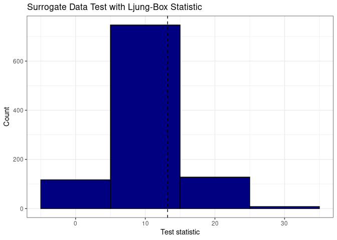
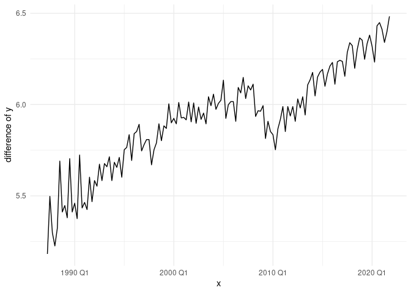
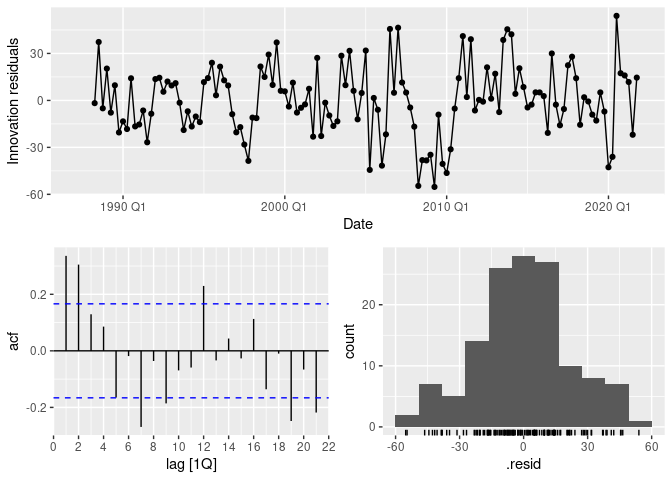
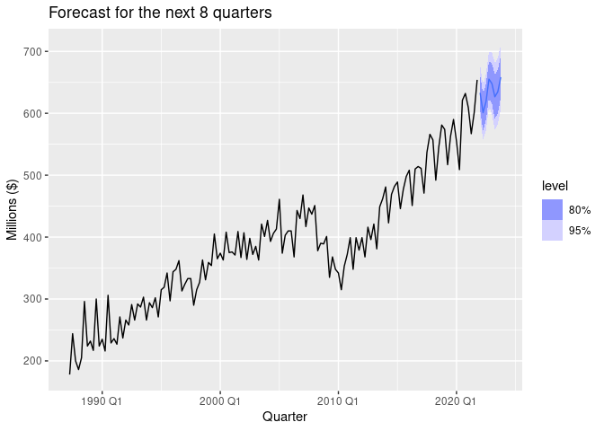
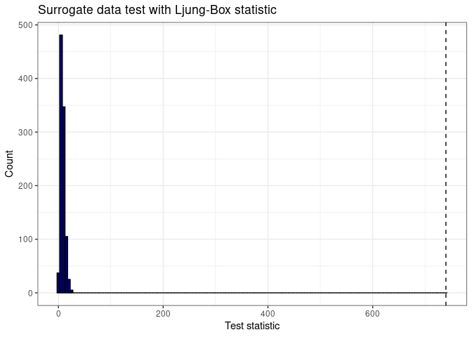
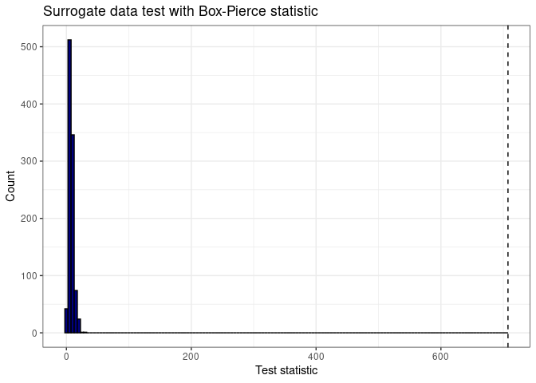
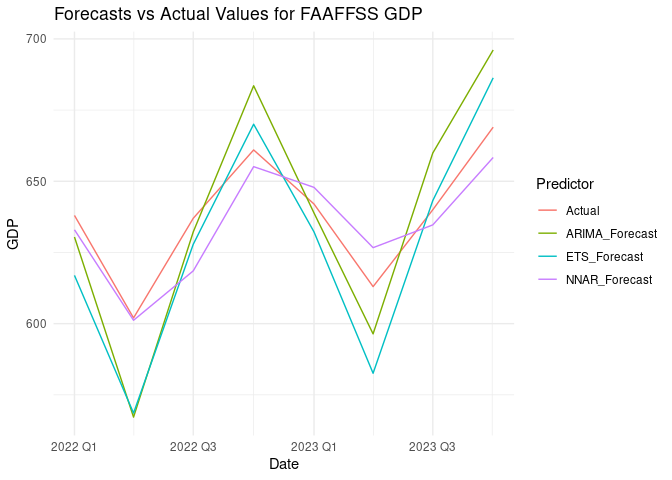

### Import Data

    base_data = read_csv("qgdp_training.csv")

    ## Rows: 139 Columns: 34
    ## ── Column specification ────────────────────────────────────────────────────────
    ## Delimiter: ","
    ## chr  (1): Date
    ## dbl (33): Agriculture, Forestry and Logging, Fishing, Aquaculture and Agricu...
    ## 
    ## ℹ Use `spec()` to retrieve the full column specification for this data.
    ## ℹ Specify the column types or set `show_col_types = FALSE` to quiet this message.

    data = base_data %>% 
      select(Date, 
             `Fishing, Aquaculture and Agriculture, Forestry and Fishing Support Services`) %>% 
      mutate(Date = yearquarter(Date)) %>% 
      rename(FAAFFSS = `Fishing, Aquaculture and Agriculture, Forestry and Fishing Support Services`)
    data = as_tsibble(data, index=Date)
    rm(list="base_data") #Delete the original dataset

### Initialise Surrogate Test Functions

    # Function to perform surrogate test for independence
    surrogate.test = function(data, lag, N = 1000, test.stat = "ljung-box") {
      
      # data: a tsibble or numeric vector object
      # lag: number of lags in portmanteau test statistic
      # N: number of permutations to perform
      # test.stat: either "ljung-box" or "box-pierce"
      
      if (is_tsibble(data)) {
        if (length(measures(data)) != 1) {  
          stop("data must be a tsibble with one measurement variable")
        }
        # Extract time series 
        data = data %>% 
          pull(as.character(measures(data)[[1]])) 
      }

      n = length(data)

      Q.null = rep(NA, N)  # Open test statistic vectors
      
      if (test.stat == "ljung-box") {
        
        # Observed test statistic
        r.obs = acf(data, plot = FALSE)$acf[2:(lag + 1)]
        Q.obs = n * (n + 2) * sum(r.obs ^ 2 / (n - 1:lag))
        
        # Null distribution
        for (i in 1:N) {
          surrogate = sample(data, n)  # Permute data (kill autocorrelation, maintain amplitude)
          r = acf(surrogate, plot = FALSE)$acf[2:(lag + 1)]   # Estimate autocorrelation
          Q.null[i] = n * (n + 2) * sum(r ^ 2 / (n - 1:lag))  # Ljung-Box test statistic
        }
        
      }
      
      if (test.stat == "box-pierce") {
        
        # Observed test statistic
        r.obs = acf(data, plot = FALSE)$acf[2:(lag + 1)]
        Q.obs = n * sum(r.obs ^ 2)
        
        # Null distribution
        for (i in 1:N) {
          surrogate = sample(data, n)  # Permute data (kill autocorrelation, maintain amplitude)
          r = acf(surrogate, plot = FALSE)$acf[2:(lag + 1)]  # Estimate autocorrelation
          Q.null[i] = n * sum(r ^ 2)                         # Box-Pierce test statistic
        }
        
      }
      
      # Compute p-value
      p.value = mean(Q.null >= Q.obs)  # p-value

      # Output
      output = list(Q.null = Q.null,
                    Q.obs = Q.obs,
                    test.stat = test.stat,
                    p.value = p.value)
      
      class(output) = "surrogate"
      
      return(output)
      
    }

    # Function to plot surrogate null distribution and observed test statistic
    # Requires ggplot2
    plot.surrogate = function(obj, binwidth = 10) {
      
      # obj: Object of class "surrogate"
      # binwidth: width of the bins for the histogram

      ggplot(data = data.frame(Q = obj$Q.null),
             mapping = aes(x = Q)) +
        geom_histogram(fill = "navy", colour = "black", binwidth = binwidth) +
        geom_vline(xintercept = obj$Q.obs,
                   linetype = "dashed") +
        labs(x = "Test statistic",
             y = "Count") 
      
    }

# Exploratory Analysis

This is a quarterly GDP data from 1987 Q4 to 2021 Q4 on the Fishing,
Aquaculture and Agriculture, Forestry and Fishing Support Services
industry groups in NZ. The data has been adjusted to the CPI of
2009/2010.

    # plots
    data %>% 
      autoplot() +
      labs(title = "Quarterly GDP for Aquaculture and Agriculture and Forestry in NZ",
           x = "Year Quarter",
           y = "Millions ($)")

    ## Plot variable not specified, automatically selected `.vars = FAAFFSS`

    data %>% 
      gg_subseries() +
      labs(title = "Subseries quarterly GDP for Aquaculture and Agriculture and Forestry in NZ",
           x = "Year",
           y = "Millions ($)")

    ## Plot variable not specified, automatically selected `y = FAAFFSS`

    data %>% 
      gg_season() +
      labs(title = "Seasonal plot for quarterly GDP for Aquaculture and Agriculture and Forestry in NZ",
           x = "Year",
           y = "Millions ($)")

    ## Plot variable not specified, automatically selected `y = FAAFFSS`

    data %>% 
      gg_lag() +
      labs(title = "Lag plots for quarterly GDP for Aquaculture and Agriculture and Forestry in NZ",
           x = "lag(Millions ($), n)",
           y = "Millions ($)") +
      theme(axis.text.x = element_text(angle = 90, vjust = 0.5, hjust=1))

    ## Plot variable not specified, automatically selected `y = FAAFFSS`

    data %>% 
      ACF() %>%
      autoplot()

    ## Response variable not specified, automatically selected `var = FAAFFSS`

    decomposed_data = data %>%
      model(STL(FAAFFSS ))
    components(decomposed_data) %>% autoplot()

The time plot shows a general steady growth up of GDP until around 2008,
the trend dipped for 2 years during the economic crisis before steady
growth back up after 2010 Q1 at a faster rate. There appears to be some
quarterly seasonality however this seasonality appear to have morphed
during the period in this plot. It is a bit difficult to tell from this
plot what is happening.

The subseries plot shows the GDP changes by the quarter, the quarter all
followed the general pattern discussed earlier. However this plot shows
that on average Q2 seems to have the lowest GDP out of all the quarters.
Quarters 1, 3, 4 appear to not be to different from each other on
average. Q3 seemed to have had a slower growth than the rest up until
about 2008. The differences in the quarters suggests a quarterly
pattern.

The seasonal plot shows that the are somewhat regular seasonal patterns,
however seasonality may have changed throughout the period as suspected
previously. Q3 was had the highest GDP during the earlier years and Q2/4
had the lowest GDP. As time progressed the GDP in Q4 became the highest.
This plot also shows the general increasing tread with time looking at
how later years have higher lines, the jumbled lines in the middle of
the graph reflects the GDP decrease during 2008 to 2010.

The lag plots shows that each quarter is strongly correlated with the
previous quarter, the fuzzier lines with more lag shows that this
correlation weakens with more lag. However on lags divisible by 4, that
is the same time in a different year, the correlation becomes a bit
stronger than nearby lags, the graph showed the lines are more closely
on the diagonal in these lags. So there is a seasonal pattern

The correlation discussed earlier is reflected in the ACF plots. The
correlation decreases with more lags but there is a small spike when the
lag is divisible by 4, showing a slightly stronger correlation with a
lagged version of itself that is at the same time in a different year,
ie. a seasonal pattern.

The STL composition highlights that the general trend contributes the
most to the series, followed by the seasonality. The residuals
contribute almost as much as the seasonality to the series. The general
trend agrees what was discussed prior. The seasonality shows a clear
change throughout the period, also in line with prior discussion, eg. Q4
GDP has significantly increased in the period. The effect of seasonality
appear to have been decreasing initially up to around 2004 before
increasing again.

# ETS models

## Methodology to Create a Shortlist of Appropriate Candidate ETS Models

    # Check for missing values
    missing_values <- data %>% summarise(across(everything(), ~ sum(is.na(.))))
    print(paste("There are", nrow(missing_values),"missing values."))

    ## [1] "There are 139 missing values."

## Manual Model Fitting:

Defining ETS Models: Manually specify and fit a variety of ETS models
with different combinations of error (E), trend (T), and seasonality (S)
components.

The models are categorized as follows:

Error Component (E): Additive (A) or Multiplicative (M).

Trend Component (T): None (N), Additive (A), Multiplicative (M), or
Additive damped (Ad).

Seasonality Component (S): None (N), Additive (A), or Multiplicative
(M).

Model Examples: Fit models such as ETS(A, N, N) for Simple Exponential
Smoothing, ETS(A, A, N) for Holt’s Linear Trend, and ETS(A, A, A) for
Additive Holt-Winters, among others.

    # Manually fit different ETS models
    # ETS(A,N,N): Model for simple exponential smoothing (SES)
    fit_ann <- data %>% model(ETS(FAAFFSS ~ error("A") + trend("N") + season("N")))
    # ETS(M,N,N): SES with multiplicative errors
    fit_mnn <- data %>% model(ETS(FAAFFSS ~ error("M") + trend("N") + season("N")))
    # ETS(A,A,N): A model for Holt’s linear trend method
    fit_aan <- data %>% model(ETS(FAAFFSS ~ error("A") + trend("A") + season("N")))
    # ETS(M,A,N): Holt’s linear trend method with multiplicative errors
    fit_man <- data %>% model(ETS(FAAFFSS ~ error("M") + trend("A") + season("N")))
    fit_amn <- data %>% model(ETS(FAAFFSS ~ error("A") + trend("M") + season("N")))
    fit_mmn <- data %>% model(ETS(FAAFFSS ~ error("M") + trend("M") + season("N")))
    fit_ana <- data %>% model(ETS(FAAFFSS ~ error("A") + trend("N") + season("A")))
    fit_mna <- data %>% model(ETS(FAAFFSS ~ error("M") + trend("N") + season("A")))
    fit_aaa <- data %>% model(ETS(FAAFFSS ~ error("A") + trend("A") + season("A")))
    fit_maa <- data %>% model(ETS(FAAFFSS ~ error("M") + trend("A") + season("A")))
    fit_ama <- data %>% model(ETS(FAAFFSS ~ error("A") + trend("M") + season("A")))
    fit_mma <- data %>% model(ETS(FAAFFSS ~ error("M") + trend("M") + season("A")))
    fit_anm <- data %>% model(ETS(FAAFFSS ~ error("A") + trend("N") + season("M")))
    fit_mnm <- data %>% model(ETS(FAAFFSS ~ error("M") + trend("N") + season("M")))
    fit_aam <- data %>% model(ETS(FAAFFSS ~ error("A") + trend("A") + season("M")))
    fit_mam <- data %>% model(ETS(FAAFFSS ~ error("M") + trend("A") + season("M")))
    fit_amm <- data %>% model(ETS(FAAFFSS ~ error("A") + trend("M") + season("M")))
    fit_mmm <- data %>% model(ETS(FAAFFSS ~ error("M") + trend("M") + season("M")))
    fit_adn <- data %>% model(ETS(FAAFFSS ~ error("A") + trend("Ad") + season("N")))
    fit_mdn <- data %>% model(ETS(FAAFFSS ~ error("M") + trend("Ad") + season("N")))
    fit_ada <- data %>% model(ETS(FAAFFSS ~ error("A") + trend("Ad") + season("A")))
    fit_mda <- data %>% model(ETS(FAAFFSS ~ error("M") + trend("Ad") + season("A")))
    fit_adm <- data %>% model(ETS(FAAFFSS ~ error("A") + trend("Ad") + season("M")))
    fit_mdm <- data %>% model(ETS(FAAFFSS ~ error("M") + trend("Ad") + season("M")))

## Automatic Model Selection:

Using Automated ETS: Utilize the ETS function to automatically fit the
best ETS model based on information criteria like AICc (Akaike
Information Criterion corrected for small sample sizes).

    # Automatically fit the ETS model
    fit_auto <- data %>% model(ETS(FAAFFSS))
    report(fit_auto)

    ## Series: FAAFFSS 
    ## Model: ETS(M,A,M) 
    ##   Smoothing parameters:
    ##     alpha = 0.5044422 
    ##     beta  = 0.007167769 
    ##     gamma = 0.4955577 
    ## 
    ##   Initial states:
    ##      l[0]     b[0]      s[0]     s[-1]    s[-2]     s[-3]
    ##  193.4443 5.672164 0.8798408 0.9597361 1.256635 0.9037881
    ## 
    ##   sigma^2:  0.0027
    ## 
    ##      AIC     AICc      BIC 
    ## 1518.864 1520.260 1545.275

## Model Comparison:

Calculating AICc Values: For each manually fitted model and the
automatically selected model, compute the AICc value. The AICc penalizes
model complexity to prevent overfitting and is useful for comparing
models.

Ranking Models: Create a list of all candidate models along with their
AICc values. Sort the models by AICc in ascending order to identify the
best-performing models.

Choosing the Lowest AICc Model: Select the model with the lowest AICc
value as the best model. This model is expected to balance goodness of
fit and model complexity.

    # Compare models using AICc
    aic_values <- bind_rows(
      glance(fit_aaa) %>% mutate(Model = "AAA"),
      glance(fit_ann) %>% mutate(Model = "ANN"),
      glance(fit_mnn) %>% mutate(Model = "MNN"),
      glance(fit_aan) %>% mutate(Model = "AAN"),
      glance(fit_man) %>% mutate(Model = "MAN"),
      glance(fit_amn) %>% mutate(Model = "AMN"),
      glance(fit_mmn) %>% mutate(Model = "MMN"),
      glance(fit_ana) %>% mutate(Model = "ANA"),
      glance(fit_mna) %>% mutate(Model = "MNA"),
      glance(fit_maa) %>% mutate(Model = "MAA"),
      glance(fit_ama) %>% mutate(Model = "AMA"),
      glance(fit_mma) %>% mutate(Model = "MMA"),
      glance(fit_anm) %>% mutate(Model = "ANM"),
      glance(fit_mnm) %>% mutate(Model = "MNM"),
      glance(fit_aam) %>% mutate(Model = "AAM"),
      glance(fit_mam) %>% mutate(Model = "MAM"),
      glance(fit_mmm) %>% mutate(Model = "MMM"),
      glance(fit_amm) %>% mutate(Model = "AMM"),
      glance(fit_adn) %>% mutate(Model = "AAdN"),
      glance(fit_mdn) %>% mutate(Model = "MAdN"),
      glance(fit_ada) %>% mutate(Model = "AAdA"),
      glance(fit_mda) %>% mutate(Model = "MAdA"),
      glance(fit_adm) %>% mutate(Model = "AAdM"),
      glance(fit_mdm) %>% mutate(Model = "MAdM"),
      glance(fit_auto) %>% mutate(Model = "AUTO_MAM"),
    ) %>% select(Model, AICc) %>% arrange(AICc)

    knitr::kable(aic_values)

<table>
<thead>
<tr class="header">
<th style="text-align: left;">Model</th>
<th style="text-align: right;">AICc</th>
</tr>
</thead>
<tbody>
<tr class="odd">
<td style="text-align: left;">MAM</td>
<td style="text-align: right;">1520.260</td>
</tr>
<tr class="even">
<td style="text-align: left;">AUTO_MAM</td>
<td style="text-align: right;">1520.260</td>
</tr>
<tr class="odd">
<td style="text-align: left;">MAdM</td>
<td style="text-align: right;">1520.394</td>
</tr>
<tr class="even">
<td style="text-align: left;">AAM</td>
<td style="text-align: right;">1522.644</td>
</tr>
<tr class="odd">
<td style="text-align: left;">AMM</td>
<td style="text-align: right;">1524.073</td>
</tr>
<tr class="even">
<td style="text-align: left;">AAA</td>
<td style="text-align: right;">1526.729</td>
</tr>
<tr class="odd">
<td style="text-align: left;">AAdM</td>
<td style="text-align: right;">1527.659</td>
</tr>
<tr class="even">
<td style="text-align: left;">AMA</td>
<td style="text-align: right;">1528.734</td>
</tr>
<tr class="odd">
<td style="text-align: left;">MMM</td>
<td style="text-align: right;">1530.183</td>
</tr>
<tr class="even">
<td style="text-align: left;">ANM</td>
<td style="text-align: right;">1530.458</td>
</tr>
<tr class="odd">
<td style="text-align: left;">MAA</td>
<td style="text-align: right;">1531.212</td>
</tr>
<tr class="even">
<td style="text-align: left;">AAdA</td>
<td style="text-align: right;">1532.881</td>
</tr>
<tr class="odd">
<td style="text-align: left;">ANA</td>
<td style="text-align: right;">1538.268</td>
</tr>
<tr class="even">
<td style="text-align: left;">MNM</td>
<td style="text-align: right;">1543.496</td>
</tr>
<tr class="odd">
<td style="text-align: left;">MMA</td>
<td style="text-align: right;">1543.846</td>
</tr>
<tr class="even">
<td style="text-align: left;">MAdA</td>
<td style="text-align: right;">1544.422</td>
</tr>
<tr class="odd">
<td style="text-align: left;">MNA</td>
<td style="text-align: right;">1547.804</td>
</tr>
<tr class="even">
<td style="text-align: left;">AAN</td>
<td style="text-align: right;">1649.688</td>
</tr>
<tr class="odd">
<td style="text-align: left;">AMN</td>
<td style="text-align: right;">1649.707</td>
</tr>
<tr class="even">
<td style="text-align: left;">AAdN</td>
<td style="text-align: right;">1653.189</td>
</tr>
<tr class="odd">
<td style="text-align: left;">ANN</td>
<td style="text-align: right;">1655.655</td>
</tr>
<tr class="even">
<td style="text-align: left;">MAN</td>
<td style="text-align: right;">1669.362</td>
</tr>
<tr class="odd">
<td style="text-align: left;">MAdN</td>
<td style="text-align: right;">1671.170</td>
</tr>
<tr class="even">
<td style="text-align: left;">MMN</td>
<td style="text-align: right;">1673.251</td>
</tr>
<tr class="odd">
<td style="text-align: left;">MNN</td>
<td style="text-align: right;">1679.913</td>
</tr>
</tbody>
</table>

## Reasons for Selecting the ETS(MAM) Model: Lowest AICc Value

Model Comparison: Among the various manually fitted models and the
automatically selected model, ETS(MAM) was found to have the lowest AICc
value. The AICc (Akaike Information Criterion corrected for small sample
sizes) is a measure of the relative quality of statistical models for a
given set of data. It considers both the goodness of fit and the
complexity of the model (penalizing for the number of parameters). A
lower AICc value indicates a better balance between model fit and
complexity.

Statistical Justification: Selecting the model with the lowest AICc
helps in minimizing overfitting while ensuring that the model adequately
captures the underlying patterns in the data.

    # Select the best model based on the lowest AICc value
    best_model <- fit_mam 
    report(best_model)

    ## Series: FAAFFSS 
    ## Model: ETS(M,A,M) 
    ##   Smoothing parameters:
    ##     alpha = 0.5044422 
    ##     beta  = 0.007167769 
    ##     gamma = 0.4955577 
    ## 
    ##   Initial states:
    ##      l[0]     b[0]      s[0]     s[-1]    s[-2]     s[-3]
    ##  193.4443 5.672164 0.8798408 0.9597361 1.256635 0.9037881
    ## 
    ##   sigma^2:  0.0027
    ## 
    ##      AIC     AICc      BIC 
    ## 1518.864 1520.260 1545.275

## In an ETS(MAM) model:

E stands for the error term, which is multiplicative.

T stands for the trend component, which is additive.

S stands for the seasonal component, which is multiplicative.

The general form of the ETS(MAM) model equations are:
*y**t* = (*l**t* − 1+*b**t* − 1)*s**t* − *m*(1+*ϵ**t*)
*l**t* = (*l**t* − 1+*b**t* − 1)(1+*α**ϵ**t*)
*b**t* = *b**t* − 1 + *β*(*l**t* − 1+*b**t* − 1)*ϵ**t*
*s**t* = *s**t* − *m*(1+*γ**ϵ**t*)
Where:

*y**t* is the observed value at time t.

*l**t* is the level component at time t.

*b**t* is the trend component at time t.

*s**t* is the seasonal component at time t.

α, β, and γ are the smoothing parameters for the level, trend, and
seasonal components, respectively.

m is the period of seasonality.

    # Plot the fitted values
    best_model %>% augment()

    ## # A tsibble: 139 x 6 [1Q]
    ## # Key:       .model [1]
    ##    .model                                  Date FAAFFSS .fitted  .resid   .innov
    ##    <chr>                                  <qtr>   <dbl>   <dbl>   <dbl>    <dbl>
    ##  1 "ETS(FAAFFSS ~ error(\"M\") + trend… 1987 Q2     178    180.  -1.96  -0.0109 
    ##  2 "ETS(FAAFFSS ~ error(\"M\") + trend… 1987 Q3     244    256. -12.0   -0.0467 
    ##  3 "ETS(FAAFFSS ~ error(\"M\") + trend… 1987 Q4     200    196.   3.76   0.0192 
    ##  4 "ETS(FAAFFSS ~ error(\"M\") + trend… 1988 Q1     186    187.  -0.583 -0.00313
    ##  5 "ETS(FAAFFSS ~ error(\"M\") + trend… 1988 Q2     205    195.   9.63   0.0493 
    ##  6 "ETS(FAAFFSS ~ error(\"M\") + trend… 1988 Q3     296    280.  15.6    0.0556 
    ##  7 "ETS(FAAFFSS ~ error(\"M\") + trend… 1988 Q4     224    233.  -9.12  -0.0391 
    ##  8 "ETS(FAAFFSS ~ error(\"M\") + trend… 1989 Q1     232    212.  19.8    0.0932 
    ##  9 "ETS(FAAFFSS ~ error(\"M\") + trend… 1989 Q2     217    238. -21.3   -0.0895 
    ## 10 "ETS(FAAFFSS ~ error(\"M\") + trend… 1989 Q3     300    319. -18.9   -0.0593 
    ## # ℹ 129 more rows

    augment(best_model) %>%
    ggplot(aes(x = Date)) +
    geom_line(aes(y = FAAFFSS, colour = "Data")) +
    geom_line(aes(y = .fitted, colour = "Fitted")) +
    guides(colour = guide_legend(title = ""))

 \## Model
Diagnostics:

Residual Analysis: Perform residual diagnostics on the selected model to
ensure that the residuals behave like white noise (i.e., they are
uncorrelated and have constant variance).

Components Decomposition: Decompose the selected model to inspect its
components (level, trend, and seasonality) for better understanding and
validation.

    # Residual diagnostics
    best_model %>% gg_tsresiduals()

    # Components Decomposition
    best_model %>%
      components() %>% 
      autoplot()

    ## Warning: Removed 4 rows containing missing values or values outside the scale range
    ## (`geom_line()`).

### Generate ETS Forecasts

    # Generate forecasts
    forecast_data <- best_model %>% forecast(h = 8)
    forecast_data

    ## # A fable: 8 x 4 [1Q]
    ## # Key:     .model [1]
    ##   .model                                                 Date      FAAFFSS .mean
    ##   <chr>                                                 <qtr>       <dist> <dbl>
    ## 1 "ETS(FAAFFSS ~ error(\"M\") + trend(\"A\") + seaso… 2022 Q1 N(617, 1014)  617.
    ## 2 "ETS(FAAFFSS ~ error(\"M\") + trend(\"A\") + seaso… 2022 Q2 N(569, 1085)  569.
    ## 3 "ETS(FAAFFSS ~ error(\"M\") + trend(\"A\") + seaso… 2022 Q3 N(628, 1599)  628.
    ## 4 "ETS(FAAFFSS ~ error(\"M\") + trend(\"A\") + seaso… 2022 Q4 N(670, 2142)  670.
    ## 5 "ETS(FAAFFSS ~ error(\"M\") + trend(\"A\") + seaso… 2023 Q1 N(632, 3011)  632.
    ## 6 "ETS(FAAFFSS ~ error(\"M\") + trend(\"A\") + seaso… 2023 Q2 N(583, 2807)  583.
    ## 7 "ETS(FAAFFSS ~ error(\"M\") + trend(\"A\") + seaso… 2023 Q3 N(643, 3733)  643.
    ## 8 "ETS(FAAFFSS ~ error(\"M\") + trend(\"A\") + seaso… 2023 Q4 N(686, 4609)  686.

    forecast_data %>% autoplot(data) +
      labs(title = "Forecast for the next 8 quarters", x = "Quarter", y = "FAAFFSS")

## Explanation of Prediction Intervals

An advantage of ETS models is that prediction intervals can be
constructed. Prediction intervals will differ between additive and
multiplicative error models.

For ETS(A,N/A/Ad,N/A) models prediction distributions are Gaussian.

For ETS(M,N/A/Ad,N/A/M) models prediction distributions are non-Gaussian
because of nonlinearity of the state space equations.

Gaussian approximation usually give reasonably accurate results.

If this approximation is not reasonable, we can generate future sample
paths conditional on the last estimate of the states, and then to obtain
prediction intervals from the percentiles of these simulated future
paths.

In the ETS model, the prediction interval is calculated based on the
variance of the residuals. The ETS (MAM) model is a multiplicative error
model, and the calculation of its prediction interval takes into account
the gradual accumulation of prediction errors. Specifically, the
prediction interval is calculated through the following steps:

Calculate point prediction value: Based on the parameters of the ETS
model and input data at future time points, calculate the future point
prediction value.

Estimate the variance of the forecast error: Use the variance of the
residuals to estimate the variance of the forecast error. For the
multiplicative error model, the variance of the error increases with
forecast time.

Calculate the prediction interval: Based on the variance of the
prediction error and using the assumption of normal distribution,
calculate the prediction interval at different confidence levels.

In R, these steps are completed automatically by the forecast function,
we only need to specify the forecast time range h.

    # Assuming `best_model` is the ETS(MAM) model we selected earlier
    residuals_data <- best_model %>% augment() %>% pull(.resid)

    # Convert residuals to a tsibble for testing
    residuals_tsibble <- tsibble(Residuals = residuals_data, Date = data$Date, index = Date)

    # Perform surrogate test
    s = surrogate.test(residuals_tsibble, lag = 10, N = 1000, test.stat = "ljung-box")

    # Extract p-value
    s$p.value

    ## [1] 0.211

    # Plot the surrogate null distribution and observed test statistic
    s %>% plot.surrogate() + theme_bw() + labs(title = "Surrogate Data Test with Ljung-Box Statistic")

 \##
Explanation of the Surrogate Test for Independence

The provided R code implements a surrogate test for independence on a
time series dataset. This test is designed to determine if the residuals
(or innovation residuals) of a model are independent, which is a key
assumption in time series analysis. The surrogate test does this by
comparing the observed autocorrelation structure of the residuals to a
distribution of autocorrelation structures obtained from permuted
(shuffled) versions of the data.

### Interpretation of the p-value

In the context of the surrogate test for independence, the p-value is
used to determine whether we can reject the null hypothesis that the
residuals are independent. The null hypothesis states that the residuals
are independent (i.e., there is no significant autocorrelation in the
residuals).

### Significance Level

A common significance level used in hypothesis testing is 0.05 (5%). If
the p-value is less than 0.05, we reject the null hypothesis and
conclude that there is significant autocorrelation in the residuals. If
the p-value is greater than or equal to 0.05, we fail to reject the null
hypothesis and conclude that there is no significant autocorrelation in
the residuals.

Since the p-value of our model is greater than the typical significance
level of 0.05, we do not have enough evidence to reject the null
hypothesis. This means that:

The residuals of the ETS(MAM) model do not show significant
autocorrelation. The residuals can be considered independent.

### Conclusion

The result of the surrogate test suggests that the residuals from the
ETS(MAM) model are independent. This is a good outcome as it implies
that the model has adequately captured the structure in the data,
leaving behind residuals that behave like white noise, which is an
important assumption in time series modeling.

    # Load the test data set
    test_data <- read.csv("qgdp_full.csv")

    # Prepare the test data
    test_data <- test_data %>%
      select(Date, `Fishing..Aquaculture.and.Agriculture..Forestry.and.Fishing.Support.Services`) %>%
      mutate(Date = yearquarter(Date)) %>%
      rename(FAAFFSS = `Fishing..Aquaculture.and.Agriculture..Forestry.and.Fishing.Support.Services`)
    test_data <- as_tsibble(test_data, index = Date)

    # Extract the relevant part of the test data (2022 Q1 to 2023 Q4)
    test_data_subset <- test_data %>%
      filter(Date >= yearquarter("2022 Q1") & Date <= yearquarter("2023 Q4"))

    # Merge forecasts with actual test data
    comparison_data <- forecast_data %>%
      left_join(test_data_subset, by = "Date") %>%
      rename(Forecast = .mean, Actual = FAAFFSS.y) %>%
      select(Date, Forecast, Actual)

    # Calculate accuracy metrics
    accuracy_metrics <- accuracy(comparison_data$Forecast, comparison_data$Actual)

    # Print accuracy metrics
    knitr::kable(accuracy_metrics)

<table>
<thead>
<tr class="header">
<th style="text-align: left;"></th>
<th style="text-align: right;">ME</th>
<th style="text-align: right;">RMSE</th>
<th style="text-align: right;">MAE</th>
<th style="text-align: right;">MPE</th>
<th style="text-align: right;">MAPE</th>
</tr>
</thead>
<tbody>
<tr class="odd">
<td style="text-align: left;">Test set</td>
<td style="text-align: right;">9.280548</td>
<td style="text-align: right;">19.54906</td>
<td style="text-align: right;">16.67565</td>
<td style="text-align: right;">1.539261</td>
<td style="text-align: right;">2.654215</td>
</tr>
</tbody>
</table>

## Discussion on Model Performance

The ETS(MAM) model’s performance in forecasting the GDP values for the
“Fishing, Aquaculture, and Agriculture, Forestry, and Fishing Support
Services” sector from 2022 Q1 to 2023 Q4 is evaluated using several
accuracy metrics.

#### Overall Performance

The ETS(MAM) model demonstrates a strong performance in forecasting the
GDP for the sector in question. The low values of ME, MAE, MPE, and MAPE
indicate that the model’s forecasts are generally accurate and close to
the actual values. The RMSE, while slightly higher, suggests that there
are some larger errors, but they do not dominate the overall accuracy.

#### Strengths and Limitations

Strengths: The model captures the seasonal patterns and trends
effectively, as evidenced by the low MAPE and MAE. The small positive
bias indicates that the model slightly overestimates but is generally
reliable.

Limitations: The RMSE suggests that there are a few instances of larger
errors. These may need further investigation to understand and
potentially refine the model. The model could be improved by
incorporating additional factors or using alternative modelling
techniques to further reduce the forecast errors.

In conclusion, the ETS(MAM) model provides reliable forecasts for the
GDP values of the “Fishing, Aquaculture, and Agriculture, Forestry, and
Fishing Support Services” sector, with a high degree of accuracy and
only minor bias. Continuous monitoring and refinement could enhance the
model’s performance further.

# Arima Models

## Explore different ARIMA models

### Explain any transformations or differencing required

From data autoplot graph, we can see:

1.  the seasonal variations are increasing over time which suggests a
    multiplicative seasonality pattern. So we would do a log
    transformation to stabilize the variance. This transformation
    converts multiplicative relationships into additive ones, making the
    series easier to model.

2.  the data seems to have a yearly seasonal effect that repeats every 4
    quarters. So we would also perform differencing for seasonality to
    remove this effect.

3.there is an upward trend indicates that the mean of the series is not
constant over time. So we would need to do first difference to make the
series stationary in terms of the trend. However, as the data has a
strong seasonal pattern, we will apply seasonal differencing first,
because sometimes the resulting series will be stationary and there will
be no need for a further first difference.

    # Log transform to remove the non-constant variance. 

    data %>% 
      autoplot(log(FAAFFSS) ) + 
      labs(x = "x", y = "difference of y") + 
      theme_minimal() 

We can see that the log transformation of the data removed the large
change in variability and made the variance roughly concept, perhaps
except for the first few peaks around 1990.

    # differencing seasonality

    data %>% 
      autoplot(log(FAAFFSS) %>% difference(lag=4)) + 
      labs(x = "x", y = "difference of y") + 
      theme_minimal() 

    ## Warning: Removed 4 rows containing missing values or values outside the scale range
    ## (`geom_line()`).

After differencing seasonality, we can’t see any non stationary patterns
now. we removed the autocorrelation in seasonality. It also shows flat
trend and the mean is roughly constant, which suggests we removed the
trend by seasonal differencing and we don’t need to to first order
difference anymore. So we have a stationary time series.

    # test if now the time series data are stationary and non-seasonaly with KPSS test
    data  %>%
      features(FAAFFSS , unitroot_kpss)

    ## # A tibble: 1 × 2
    ##   kpss_stat kpss_pvalue
    ##       <dbl>       <dbl>
    ## 1      2.47        0.01

    data  %>%
      features(log(FAAFFSS)%>%difference(4)%>%difference(1) , unitroot_kpss)

    ## # A tibble: 1 × 2
    ##   kpss_stat kpss_pvalue
    ##       <dbl>       <dbl>
    ## 1    0.0311         0.1

We can see the change of kpss after applying the transformation and
difference. There is now no evidence against the null hypothesis of non
stationarity. which means we have a stationary time series.

Or we can test how many differences we need to do to get a stationary
time series. It shows 1 is enough, which with aligns with what we have
already seen.

    data %>%
    features(FAAFFSS, unitroot_ndiffs)

    ## # A tibble: 1 × 1
    ##   ndiffs
    ##    <int>
    ## 1      1

    data %>%
    mutate(log_fa = log(FAAFFSS)) %>%
    features(log_fa, feat_stl)

    ## # A tibble: 1 × 9
    ##   trend_strength seasonal_strength_year seasonal_peak_year seasonal_trough_year
    ##            <dbl>                  <dbl>              <dbl>                <dbl>
    ## 1          0.992                  0.869                  2                    1
    ## # ℹ 5 more variables: spikiness <dbl>, linearity <dbl>, curvature <dbl>,
    ## #   stl_e_acf1 <dbl>, stl_e_acf10 <dbl>

    data %>%
    features(FAAFFSS, unitroot_nsdiffs)

    ## # A tibble: 1 × 1
    ##   nsdiffs
    ##     <int>
    ## 1       1

### Describe methodology used to create a shortlist of appropriate candidate ARIMA models (Fit both manually & automatically)

Now we will check on the acf and pacf to help us decide appropriate
candidate ARIMA models.

    data %>%gg_tsdisplay( log(FAAFFSS) %>% difference(4)%>% difference(1) , plot_type = "partial",lag_max = 24)

    ## Warning: Removed 5 rows containing missing values or values outside the scale range
    ## (`geom_line()`).

    ## Warning: Removed 5 rows containing missing values or values outside the scale range
    ## (`geom_point()`).

First we look at the seasonal terms: we focuse on lags that are
multiples of the seasonal period ( lag 4, lag 8, lag 12, etc., for a
quarterly series with a period of 4).

-   For the autoregression process, we check the pacf plot and see that
    the significant peaks up to 2 and no significant peaks afterwards.
    it suggest 2 seasonal autoregressive terms. (P=2)

-   Likewise,for the moving average process, we check the acf plot and
    see significant peaks up to the order of 1 and no significant peaks
    afterwards. it suggest 1 moving average terms.(Q=1)

Next we look at the non-seasonal terms: we will restrict to the lags
lower than our seasonal frequency of 4.

-   For the autoregression process,we see there are only 1 peaks. it
    suggest 1 autoregressive terms. (p=1)

-   For the moving average process, we see there are only 1 peaks. it
    suggest 1 autoregressive terms. (q=1)

We can summarise as : Non-seasonal: ARIMA(1, 1, 1); Seasonal: (2, 1,
1)\[4\]

    # we add the manual fit and automatical fit together. p is autoregression,q is moving average

    fit <- data %>%
      model(arima_110210 = ARIMA(log(FAAFFSS) ~ pdq(1, 1, 0) + PDQ(2, 1, 0)),
            arima_110011 = ARIMA(log(FAAFFSS) ~ pdq(1, 1, 0) + PDQ(0, 1, 1)),
            arima_011210 = ARIMA(log(FAAFFSS) ~ pdq(0, 1, 1) + PDQ(2, 1, 0)),
            arima_011011 = ARIMA(log(FAAFFSS) ~ pdq(0, 1, 1) + PDQ(0, 1, 1)),
            stepwise = ARIMA(log(FAAFFSS)),
            search = ARIMA(log(FAAFFSS), stepwise = FALSE))

## Select the best model & explain why

We compare the result of both manual and auto fit ARIMA model and select
the model with smallest AICc as the best model. Here we will select the
auto fitted one “search” as our best model.

    glance(fit) %>% 
      arrange(AICc) %>% 
      select(.model:BIC) %>% 
      knitr::kable()

<table>
<thead>
<tr class="header">
<th style="text-align: left;">.model</th>
<th style="text-align: right;">sigma2</th>
<th style="text-align: right;">log_lik</th>
<th style="text-align: right;">AIC</th>
<th style="text-align: right;">AICc</th>
<th style="text-align: right;">BIC</th>
</tr>
</thead>
<tbody>
<tr class="odd">
<td style="text-align: left;">search</td>
<td style="text-align: right;">0.0024368</td>
<td style="text-align: right;">217.4325</td>
<td style="text-align: right;">-418.8649</td>
<td style="text-align: right;">-417.7221</td>
<td style="text-align: right;">-395.6227</td>
</tr>
<tr class="even">
<td style="text-align: left;">stepwise</td>
<td style="text-align: right;">0.0025508</td>
<td style="text-align: right;">212.5361</td>
<td style="text-align: right;">-417.0722</td>
<td style="text-align: right;">-416.7645</td>
<td style="text-align: right;">-405.4511</td>
</tr>
<tr class="odd">
<td style="text-align: left;">arima_011210</td>
<td style="text-align: right;">0.0026980</td>
<td style="text-align: right;">207.1489</td>
<td style="text-align: right;">-406.2978</td>
<td style="text-align: right;">-405.9877</td>
<td style="text-align: right;">-394.7065</td>
</tr>
<tr class="even">
<td style="text-align: left;">arima_011011</td>
<td style="text-align: right;">0.0027717</td>
<td style="text-align: right;">205.0209</td>
<td style="text-align: right;">-404.0417</td>
<td style="text-align: right;">-403.8571</td>
<td style="text-align: right;">-395.3482</td>
</tr>
<tr class="odd">
<td style="text-align: left;">arima_110210</td>
<td style="text-align: right;">0.0027490</td>
<td style="text-align: right;">205.9847</td>
<td style="text-align: right;">-403.9695</td>
<td style="text-align: right;">-403.6594</td>
<td style="text-align: right;">-392.3781</td>
</tr>
<tr class="even">
<td style="text-align: left;">arima_110011</td>
<td style="text-align: right;">0.0028107</td>
<td style="text-align: right;">204.1413</td>
<td style="text-align: right;">-402.2826</td>
<td style="text-align: right;">-402.0980</td>
<td style="text-align: right;">-393.5891</td>
</tr>
</tbody>
</table>

    # Report best model
    fit %>%
      select(search) %>%
      report()

    ## Series: FAAFFSS 
    ## Model: ARIMA(4,0,2)(0,1,0)[4] w/ drift 
    ## Transformation: log(FAAFFSS) 
    ## 
    ## Coefficients:
    ##          ar1      ar2     ar3      ar4     ma1     ma2  constant
    ##       0.0877  -0.2112  0.5777  -0.2686  0.6092  0.7034    0.0271
    ## s.e.  0.1518   0.1036  0.0946   0.1033  0.1455  0.1344    0.0095
    ## 
    ## sigma^2 estimated as 0.002437:  log likelihood=217.43
    ## AIC=-418.86   AICc=-417.72   BIC=-395.62

### Write the model equation in backshift notation

The best model specifies an ARIMA(4,0,2)(0,1,0)\[4\] model, which means:

#### Model Components

-   *p* = 4: Number of autoregressive terms
-   *d* = 0: Degree of non-seasonal differencing
-   *q* = 2: Number of moving average terms
-   *P* = 0: Number of seasonal autoregressive terms
-   *D* = 1: Degree of seasonal differencing
-   *Q* = 0: Number of seasonal moving average terms
-   *s* = 4: Seasonal period

The backshift operator *B* is defined as
*B**k**y**t* = *y**t* − *k*. Using this
notation, the model can be written as:

##### Seasonal Differencing

(1−*B*4)*y**t* = *y**t* − *y**t* − 4

##### Non-Seasonal Part

The non-seasonal part of the ARIMA model with autoregressive (AR) and
moving average (MA) terms is:

(1−*ϕ*1*B*−*ϕ*2*B*2−*ϕ*3*B*3−*ϕ*4*B*4)(1−*B*4)*y**t* = (1+*θ*1*B*+*θ*2*B*2)*ϵ**t*

where: -
*ϕ*1, *ϕ*2, *ϕ*3, *ϕ*4 are
the autoregressive parameters - *θ*1, *θ*2 are the
moving average parameters - *ϵ**t* is the white noise error
term

Putting it all together, the ARIMA(4,0,2)(0,1,0)\[4\] model is:

(1−*ϕ*1*B*−*ϕ*2*B*2−*ϕ*3*B*3−*ϕ*4*B*4)(1−*B*4)*y**t* = (1+*θ*1*B*+*θ*2*B*2)*ϵ**t*

### Produce residual diagnostic plots

    # Check residuals
    fit %>% 
      select(search) %>%
      gg_tsresiduals()

    fit %>% 
      select(search) %>%
      augment()%>%
      features(.resid,ljung_box,lag=8,dof=7)

    ## # A tibble: 1 × 3
    ##   .model lb_stat lb_pvalue
    ##   <chr>    <dbl>     <dbl>
    ## 1 search    4.11    0.0427

The predictor variables appear to be linear with the forecast variable.
We can see this linearity in the plot of the observed versus fitted
values. The time plot of residuals show that the residuals appear to
have zero mean and constant variance. The histogram of the residuals
appears to be symmetric and normally distributed. The correlogram of the
residuals shows significant autocorrelation at lag 10. It contributes
towards the Ljung-Box test statistic(4.1). The p-value from this test is
0.0427, slightly under the significant level of 0.05, which gives us
some evidence against the null hypothesis that the residuals are
independent, suggesting the residuals are still a bit autocorrelated.
This means there is information left in the residuals that should be
used for forecasting. Therefore, all model assumptions apart from
independence have been met.

### Produce forecasts for h=8 quarters

    ARIMA_forecast = fit %>% 
      select(search) %>%
      forecast(h = 8) 
    ARIMA_forecast %>%
      autoplot(data) + 
      labs(title = "Forecast for the next 8 quarters", x = "Quarter", y = "Millions ($)") +
      theme_minimal()

### Explain how prediction intervals are calculated for the method

A SARIMA model is denoted as ARIMA(p,d,q)(P,D,Q)\[s\].Once the SARIMA
model is fitted, forecasts are generated. The forecast error variance
for a given horizon ℎ considers both non-seasonal and seasonal
components. The variance increases with the forecast horizon due to the
accumulation of uncertainty over time. and prediction intervals increase
as ℎ increases.

In Prediction intervals calculations, it assume residuals are
uncorrelated and normally distributed. so the PI are based on the
forecast error variance and the critical values from the standard normal
distribution. If the model fails the assumption, like it fails the
Ljung-Box test, the prediction intervals may not be accurate due to
correlated residuals.

*Ŷ**t* + *h* ± *z**α*/2 ⋅ *σ**h*
Where: - *Ŷ**t* + *h* is the forecasted value for time
*t* + *h*. - *z**α*/2 is the critical value from the standard
normal distribution for the desired confidence level (e.g., 1.96 for 95%
confidence). - *σ**h* is the standard deviation of the
forecast errors at horizon ℎ

# Neural Network Auto Regression Model

To understand how a Neural Network Auto Regression (NNAR) model works,
its important to first understand the workings of a standard feed
forward neural network.

### Understanding Neural Networks

A neural network is modelled after the way human brains work, in that
each thought is a result of multiple different neurons firing. Neural
networks act in a similar way, in that each prediction or output of the
model is a result of several nodes or “neurons” combining their
predictions together to come to a single prediction. In a feedforward
neural network, the network is comprised of an input layer which
includes the input data being fed into the model, optional hidden layers
which taken in the output from the previous layer as input, and an
output layer which returns the final prediction. The most basic neural
network has no hidden layers, which acts the same as a linear regression
model, since each input is given a weight, plus an additional bias
(intercept) parameter. Hidden layers take the outputs of their preceding
layers as inputs and then take a weighted linear sum of them, and alter
them by a non linear function such as sigmoid or relu. These hidden
layers allow non linearity to be captured by the model for more
complicated relationships.

<figure>

<figcaption aria-hidden="true">Example Neural Network</figcaption>
</figure>

When training a feed forward neural network, each node in the network
begins with random weights, which are then adjusted to minimize some
metric - in the case of NNAR models this metric is MSE. Each iteration
of training updates the weights of each node in the network, and then
calculates the MSE of the models predictions when using these weights.
The network then uses a process called back propagation to assess each
node in the network to find which nodes were responsible for the most
error in the result, so that in the next iteration these nodes can have
their weights changed more drastically to improve the model as much as
possible.

### Understanding the Neural Network Auto Regression Model

NNAR models are neural networks which take lagged values of the time
series as inputs to the model in order to make predictions. These NNAR
models can have many hidden layers, but we fit ours with just one in
order to keep the model from being overly complicated. NNAR models are
described by the notation NNAR(p, P, k), where p represents the amount
of regular lagged inputs into the model, P represents the number of
seasonal lags included as input to the model, and k is the number of
neurons in the hidden layer. The easiest way to understand these
parameters is by looking at an example.

Say we are fitting an NNAR(3,2,3) model on a dataset with yearly
seasonality. Here we have a p parameter of 3, meaning in order to
predict *y**n*, we will take the lagged inputs
*y**n* − 1, *y**n* − 2, *y**n* − 3.
Additionally we have the P parameter of 2, meaning we will take the
seasonal lags *y**n* − 12, *y**n* − 24. This means
our model will have an input layer of 5 nodes which take in the lagged
inputs
*y**n* − 1, *y**n* − 2, *y**n* − 3, *y**n* − 12, *y**n* − 24.
Also since our model has a k parameter of 3, it means there is a hidden
layer containing 3 neurons, which each take the outputs from the input
layer as their respective inputs.

For our model we use the NNETAR() function to fit an NNAR model for us
which will calculate optimal parameters for us. By default the model
will determine p by fitting a linear model on the seasonally adjusted
time series and taking the optimal number of lags according to AIC. The
P parameter will automatically be set to 1, and the k parameter is set
to (p + P + 1)/2.

## Model fitting

    NN.fit = data %>% 
      model(base_model = NNETAR()) %>% 
      report()

    ## Model not specified, defaulting to automatic modelling of the `FAAFFSS`
    ## variable. Override this using the model formula.

    ## Series: FAAFFSS 
    ## Model: NNAR(1,1,2)[4] 
    ## 
    ## Average of 20 networks, each of which is
    ## a 2-2-1 network with 9 weights
    ## options were - linear output units 
    ## 
    ## sigma^2 estimated as 483.9

    NN.fit %>% gg_tsresiduals()

    ## Warning: Removed 4 rows containing missing values or values outside the scale range
    ## (`geom_line()`).

    ## Warning: Removed 4 rows containing missing values or values outside the scale range
    ## (`geom_point()`).

    ## Warning: Removed 4 rows containing non-finite outside the scale range
    ## (`stat_bin()`).

    NN_forecast = NN.fit %>% 
      forecast(h=8) 
    NN_forecast %>% 
      autoplot(data) +
      labs(title = "Forecast for the next 8 quarters", x = "Quarter", y = "Millions ($)")

### Report the fitted model

We can see the NNAR model was wit with p = 1, P = 1, and k = 2,
following the method of parameter choice we discussed prior. This
suggests that the optimal number of lags according to AIC must have been
1.

### Prediction Interval Calculation

Since the NNAR model is not based on a well defined stochastic model,
there is not a straightforward method to calculate the prediction
interval. To account for this, bootstrapping is done in order to
determine the variability for each prediction.

The NNAR(1,1,2) model that we fit to the FAAFFSS data can be written as
*y**t* = *f*(*z**t* − 1) + *ϵ**t*,
where *z**t* = (*y**t* − 1,*y**t* − 4)
where the errors *ϵ**t* are assumed to be normally
distributed around zero. Using this assumption, we can use our model to
make a prediction for the next time period *y**t* + 1 and add
a bootstrapped error, either drawn from the normal distribution or taken
from the sample of errors we saw in the training set. If we do this
several times (The forecast function does it 1000 times by default) then
we can approximate the prediction interval by finding the band which
contains 80% and 95% of (predictions + errors) at the next time period.
This process can be repeated for as many forecast periods as we like by
using the most recent prediction as the input for the new predictions.

# Assumption checking.

Surrogate data testing is a method used in time series analysis to check
whether the data can be described by a linear process. We first assume
the data follows a linear process, then create several surrogate
datasets using the original dataset through Monte Carlo methods.

A common way to create these surrogate datasets is the Random Shuffle
method, where surrogate data is generated from shuffling the original
data like a deck of cards. This method destroys any temporal structure
or pattern but keeps the overall distribution of values untouched.

If the original data had some kind of significant structure or pattern,
it should stand out when compared to the shuffled surrogate data.

The next step is to calculate a differentiating statistic for both the
original time series and the surrogate datasets. If the statistic
calculated for the original time series differs significantly from the
surrogate datasets, we reject the null hypothesis of linearity, that is,
the original time series was non-linear.

    # Run surrogate test on the data
    s = surrogate.test(data, lag = 8)
    print(paste0("P-value for Ljung-Box statistic: ", s$p.value))

    ## [1] "P-value for Ljung-Box statistic: 0"

    s %>% 
      plot.surrogate(binwidth = 5) + 
      theme_bw() +
      labs(title = "Surrogate data test with Ljung-Box statistic")

    p = surrogate.test(data, lag = 8, test.stat = "box-pierce")
    print(paste0("P-value for Box-Pierce statistic: ", p$p.value))

    ## [1] "P-value for Box-Pierce statistic: 0"

    p %>% 
      plot.surrogate(binwidth = 5) + 
      theme_bw() +
      labs(title = "Surrogate data test with Box-Pierce statistic")

### Explaining the r code

Surrogate.test calculates the observed test statistic and the null
distribution according to the test statistic chosen. The observed test
statistic is calculated using the autocorrelation function of the data.
The null distribution is generated by permuting the data and calculating
the test statistic for each permutation.

The p-value is then calculated as the proportion of the null
distribution that is greater than or equal to the observed test
statistic.

The function returns a list containing the null distribution, the
observed test statistic, the test statistic used, and the p-value.

The plot.surrogate() function plots the surrogate null distribution and
the observed test statistic, using the output from surrogate.test. A
histogram is plotted for the surrogate test statistics and a vertical
dashed line is plotted for the observed test statistic calculated from
the original data. I modified this to include a parameter for the
histogram bar width.

### The results

The p-value for both statistics is 0 and from the graph it is clear why
that is the case. The vertical dashed line (observed test statistic) is
far away from the histogram. Hence we reject the null hypothesis of
independence in the residuals.

# Forecasting accuracy

    full_data = read_csv("qgdp_full.csv")

    ## Rows: 147 Columns: 34
    ## ── Column specification ────────────────────────────────────────────────────────
    ## Delimiter: ","
    ## chr  (1): Date
    ## dbl (33): Agriculture, Forestry and Logging, Fishing, Aquaculture and Agricu...
    ## 
    ## ℹ Use `spec()` to retrieve the full column specification for this data.
    ## ℹ Specify the column types or set `show_col_types = FALSE` to quiet this message.

    full_data = full_data %>% mutate(Date = yearquarter(Date)) %>%
      select(Date, `Fishing, Aquaculture and Agriculture, Forestry and Fishing Support Services`) %>%
      rename(FAAFFSS = `Fishing, Aquaculture and Agriculture, Forestry and Fishing Support Services`)
    full_data = full_data %>% 
     as_tsibble(index = Date)

    rbind(
      as.matrix(accuracy(forecast_data, full_data)),
      as.matrix(accuracy(ARIMA_forecast, full_data)),
      as.matrix(accuracy(NN_forecast, full_data))
    ) %>% 
      knitr::kable()

<table style="width:100%;">
<colgroup>
<col style="width: 38%" />
<col style="width: 4%" />
<col style="width: 7%" />
<col style="width: 6%" />
<col style="width: 6%" />
<col style="width: 7%" />
<col style="width: 6%" />
<col style="width: 7%" />
<col style="width: 7%" />
<col style="width: 7%" />
</colgroup>
<thead>
<tr class="header">
<th style="text-align: left;">.model</th>
<th style="text-align: left;">.type</th>
<th style="text-align: left;">ME</th>
<th style="text-align: left;">RMSE</th>
<th style="text-align: left;">MAE</th>
<th style="text-align: left;">MPE</th>
<th style="text-align: left;">MAPE</th>
<th style="text-align: left;">MASE</th>
<th style="text-align: left;">RMSSE</th>
<th style="text-align: left;">ACF1</th>
</tr>
</thead>
<tbody>
<tr class="odd">
<td style="text-align: left;">ETS(FAAFFSS ~ error(“M”) + trend(“A”) +
season(“M”))</td>
<td style="text-align: left;">Test</td>
<td style="text-align: left;">9.280548</td>
<td style="text-align: left;">19.54906</td>
<td style="text-align: left;">16.67565</td>
<td style="text-align: left;">1.539261</td>
<td style="text-align: left;">2.654215</td>
<td style="text-align: left;">0.7236298</td>
<td style="text-align: left;">0.6872077</td>
<td style="text-align: left;">0.1490431</td>
</tr>
<tr class="even">
<td style="text-align: left;">search</td>
<td style="text-align: left;">Test</td>
<td style="text-align: left;">-0.3278218</td>
<td style="text-align: left;">20.05912</td>
<td style="text-align: left;">17.06621</td>
<td style="text-align: left;">0.04364299</td>
<td style="text-align: left;">2.687593</td>
<td style="text-align: left;">0.7405782</td>
<td style="text-align: left;">0.7051378</td>
<td style="text-align: left;">0.1612757</td>
</tr>
<tr class="odd">
<td style="text-align: left;">base_model</td>
<td style="text-align: left;">Test</td>
<td style="text-align: left;">3.327968</td>
<td style="text-align: left;">9.775642</td>
<td style="text-align: left;">8.211171</td>
<td style="text-align: left;">0.4989521</td>
<td style="text-align: left;">1.284776</td>
<td style="text-align: left;">0.3563189</td>
<td style="text-align: left;">0.3436429</td>
<td style="text-align: left;">0.1623906</td>
</tr>
</tbody>
</table>

    all_forecasts = test_data_subset %>%
      left_join(forecast_data, by = "Date") %>%
      rename(ETS_Forecast = .mean, Actual = FAAFFSS.x) %>%
      left_join(ARIMA_forecast, by = "Date") %>%
      rename(ARIMA_Forecast = .mean) %>%
      left_join(NN_forecast, by = "Date") %>%
      rename(NNAR_Forecast = .mean) %>%
      select(Date,
             ETS_Forecast,
             ARIMA_Forecast,
             NNAR_Forecast,
             Actual)

    # Plot forecasts vs actual values
    all_forecasts %>%
      pivot_longer(cols = -Date, names_to = "Predictor", values_to = "Value") %>% 
      ggplot(aes(x = Date, y = Value, color = Predictor)) +
      geom_line() +
      labs(title = "Forecasts vs Actual Values for FAAFFSS GDP", x = "Date", y = "GDP") +
      theme_minimal()

The NNAR forecast has the lowest MASE. The ARIMA model has a lower MASE
than the ETS model but they are not too different. Using MASE as the
measure NNAR made by far the best forecast. Other error measures also
suggest that the NNAR made the best predictions, it has the lowest RMSE,
MAE, MAPE, RMSSE and has an MPE and ME closest to 0. The ARIMA model did
better than the ETS model on 6 of the 7 error measures (not ME),
although not by much, so it is a distant second.

# Member Contributions

## Yuan (ych150)

-   ARIMA implementation & writeup
-   Assisted with managing github

## Stephen (shal797)

-   NNAR Implementation & writeup
-   Managing meetings, github & submission
-   Final touch ups and collation

## Yuxiao (wany441)

-   ETS implementation & writeup
-   Assisted with test set forecast comparisons

## Bill (wany803)

-   Exploratory analysis
-   Assumption checking
-   Test set forecast comparisons
